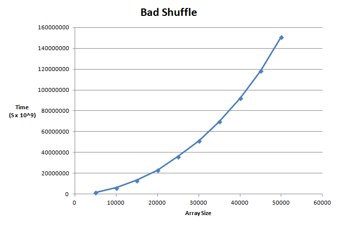
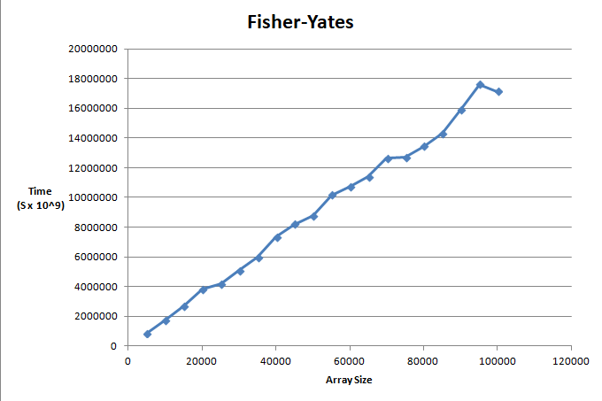
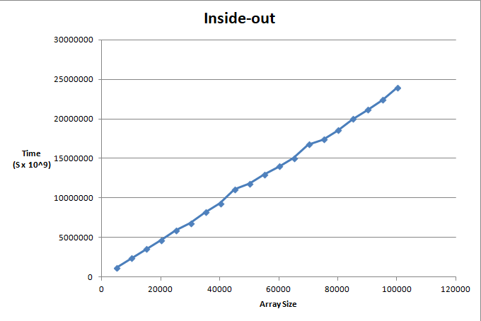
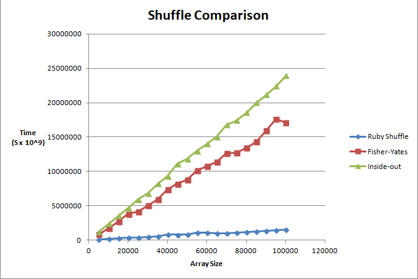

# Shuffle

Bad shuffle using costly array delete operation which leads to exponential growth

Fisher-Yates which does not use array delete looks to be linear in growth

Inside-out, a variant of Fisher-Yates, the growth does look to be more linar but does not seem to do better in this case

Comparison of Ruby, Fisher-Yates, and Inside-out shuffle

